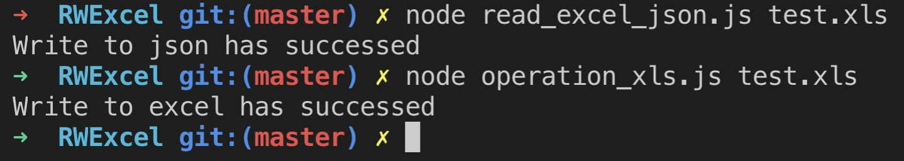
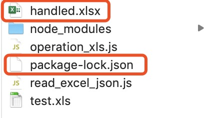

# RWExcel
## 1. node 环境 读写 Excel 操作
- `operation_xls.js` 脚本

### 引入 node-xlsx
> npm install node-xlsx --save

### 使用方法
- 执行需要传入操作的 Excel 目录

> node operation_xls.js test.xls
> 

### 操作完成.

- 控制台输出即表示操作完成

> Write to excel has successed

## 2. node 环境 读Excel 写入json格式
- `read_excel_json.js` 脚本

### 使用方法
- 执行需要传入操作的 Excel 目录

> node read_excel_json.js test.xls
> 

### 操作完成

- 控制台输出即表示操作完成

> Write to json has successed

